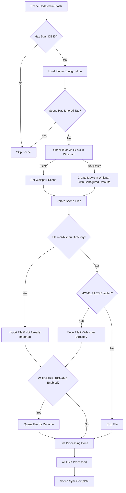

# Whisparr Bridge

Whisparr Bridge is a [Stash](https://stashapp.cc/) plugin that syncs scenes into [Whisparr](https://github.com/Whisparr/Whisparr/) when they have a StashDB link. 

Automated management of scene files, including:

- Adding movies from Stash to Whisparr
- Importing files from Stash to Whisparr
- Moving files to the correct directories
- Optional renaming of files via Whisparr

---

## How It Works

- When a scene is updated, if it has a **StashDB ID**, the plugin adds or updates the corresponding movie in Whisparr.  
- Scenes containing **ignored tags** are **skipped entirely** — no API calls or file processing are performed.  
- Files associated with the scene can be automatically imported into Whisparr.  
- Imported files can optionally be moved into the Whisparr directory and queued for renaming.  
- Detailed logging is provided for both console and file outputs.  

---
## Requirements

- Python 3.10+ (or tomli)
- Pydantic
- Requests
- `stashapi` library (custom Stash API interface)
---
## Installation

1. Copy `whisparr-bridge.py` and `whisparr-bridge.yml` into your Stash plugins directory.  
2. Install the required Python dependency:

   ```bash
   pip install stashapp-tools
   pip install pydantic
   pip install tomli (Python<3.10)
   ```

3. Restart or reload Stash to pick up the new plugin.

---

## Configuration

| Setting | Description | Default |
| --- | --- | --- |
| `WHISPARR_URL` | Base URL to your Whisparr instance. | `"localhost:6969"` |
| `WHISPARR_API_KEY` | API key from Whisparr (`Settings → General → Security`). | `""` |
| `STASHDB_ENDPOINT_SUBSTR` | Substring to identify the correct StashDB endpoint in scene external IDs. | `"stashdb.org"` |
| `MONITORED` | When `true`, new movies are monitored; otherwise unmonitored. | `True` |
| `MOVE_FILES` | When `true`, files are moved to the Whisparr directory instead of just checked. | `False` |
| `WHISPARR_RENAME` | When `true`, imported files are queued for renaming. | `True` |
| `QUALITY_PROFILE` | Default Whisparr quality profile used for new movies. | `"Any"` |
| `ROOT_FOLDER` | Default root folder path in Whisparr for new movies. If not set, the plugin uses the **first available root folder**. | `None` |
| `IGNORE_TAGS` | List of tags that cause a scene to be skipped entirely. | `[]` |
| `MAX_LOG_BODY` | Maximum length of JSON preview when logging HTTP requests/responses. | `1000` |
| `MAX_PATH_LENGTH` | Maximum length for displaying file paths in logs. | `100` |

### Logging Configuration

| Setting | Description | Default |
| --- | --- | --- |
| `LOG_LEVEL` | Stash / console logging level. | `"INFO"` |
| `LOG_FILE_ENABLE` | Enable file logging. | `False` |
| `LOG_FILE_LEVEL` | Logging level for file output. | `"DEBUG"` |
| `LOG_FILE_LOCATION` | File path for log output; empty = default (`stashtest.log`). | `""` |
| `LOG_FILE_TYPE` | File logging type: `SINGLE-FILE`, `ROTATING_SIZE`, or `ROTATING_TIME`. | `"SINGLE-FILE"` |
| `LOG_FILE_MAX_BYTES` | Max size in bytes for `ROTATING_SIZE`. | `5_000_000` |
| `LOG_FILE_BACKUP_COUNT` | Number of backup logs to keep. | `3` |
| `LOG_FILE_ROTATE_WHEN` | When to rotate logs for `ROTATING_TIME` (e.g., `"midnight"`). | `"midnight"` |
| `LOG_FILE_USE_COLOR` | Apply ANSI color codes in log file output. | `False` |
| `LOG_CONSOLE_ENABLE` | Enable console logging. | `False` |


---

### Whisparr Defaults

- New movies are created in Whisparr using the **quality profile** and **root folder** configured in the plugin settings (`QUALITY_PROFILE` and `ROOT_FOLDER`).  
- If `ROOT_FOLDER` is not specified, the plugin will use **the first available root folder** from your Whisparr instance.  
- Adjust these plugin settings if you want different defaults for new movies.

---

### Logging

- **Console logging:** Enabled by default with optional color-coded levels.  
- **File logging:** Supports single-file, size-based rotation, or time-based rotation.  
- Logs include HTTP request/response previews, file processing steps, and errors.  
- Logging levels are configurable separately for console and file.

---
### Workflow

1. Reads JSON scene data from Stash via stdin.
2. Loads plugin configuration and initializes logging.
3. Fetches the scene from Stash and checks for ignored tags.
4. Checks if the movie already exists in Whisparr.
5. Creates the movie in Whisparr if it does not exist.
6. Processes all files in the scene:
    - Moves files if needed
    - Imports files into Whisparr
    - Optionally queues a rename operation

---
## Workflow Example



---

## Troubleshooting

- **Missing settings:** Ensure Whisparr URL and API key are provided.  
- **No StashDB ID:** Scenes without the configured endpoint substring are skipped silently.  
- **Ignored tags:** Scenes with any ignored tag are skipped; check the logs to see which tag triggered the skip.  
- **File move failures:** If `MOVE_FILES=True` and files cannot be moved, check for cross-drive restrictions or permissions.  
- **Unexpected HTTP errors:** Check the logs for the exact response from Whisparr.

---
## Exceptions

Custom exceptions used in the bridge:

- `WhisparrError` – General Whisparr-related error
- `SceneNotFoundError` – Raised when a scene is missing in Whisparr
- `ManualImportError` – Raised when manual import fails

---
## License

This project does not currently include an explicit license. Please open an issue or contact the author for clarification on usage rights.
