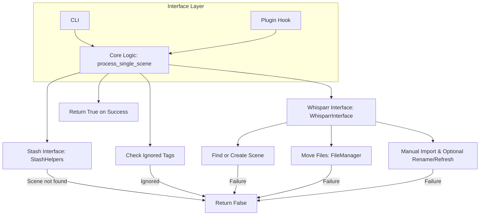
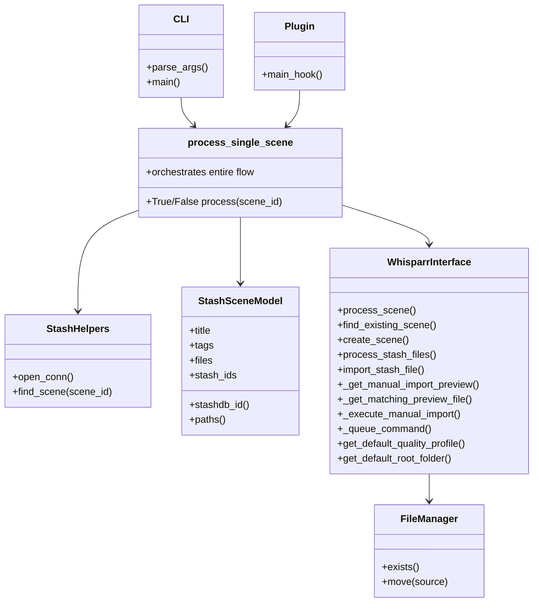

Pre-Refactor Checklist

1. Confirm Core Logic is Stable

✅ process_single_scene works consistently in CLI and plugin modes.

✅ Single-file operations succeed, with proper logging and failure handling.

2. Ensure Config & Logging Separation

✅ preprocessor() fully handles configuration loading.

✅ Logger is initialized early and passed/shared consistently.

3. Identify Failure Paths

✅ All error/edge cases are clearly handled (e.g., scene not found, validation failure).

✅ WhisparrError vs generic exceptions are differentiated.

✅ FileManager handles file existence/move reliably.

4. Break Down Responsibilities

Core logic (process_single_scene) orchestrates.

StashHelpers handles scene fetch/validation.

WhisparrInterface handles all Whisparr operations.

FileManager handles file operations.

CLI vs Plugin layer only parses args or hook data, then calls core.

5. Add Type Hints

✅ Already done for bulk_processor and main.

Consider adding type hints for WhisparrInterface, StashHelpers, and FileManager methods.

6. Decide on Testing Strategy

✅ Manual testing confirmed single-file operations.

Optional: add unit tests for:

FileManager move/existence logic.

WhisparrInterface scene find/create.

StashHelpers scene fetch & validation.

7. Plan Refactor

Keep process_single_scene as the main orchestrator.

Move CLI and Plugin handling into separate entry points (without changing logic).

Ensure new structure allows injecting mocks/stubs for testing.

